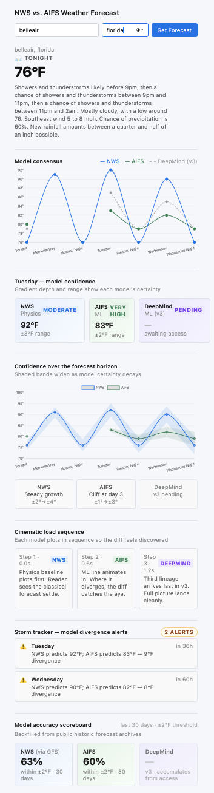

# weather-app

This app shows side-by-side weather forecasts for US locations, comparing classical physics-based numerical weather prediction with modern machine-learning forecasts. Live forecasts are accessed via the [National Weather Service](https://www.weather.gov) and [Open-Meteo API](https://open-meteo.com). The physics-based model is GFS from the National Weather Service. The machine-learning model is [ECMWF's AIFS](https://www.ecmwf.int/en/about/media-centre/news/2025/ecmwfs-ai-forecasts-become-operational). Historical accuracy is verified against [Iowa Mesonet ASOS](https://mesonet.agron.iastate.edu/) observations. v2 ships with both so you can see where physics and ML agree and where they diverge. A future v3 will add [Google DeepMind's WeatherNext](https://developers.google.com/weathernext/).

[**Live demo**](https://williamcs50.github.io/weather-app/) -- try it with any US city

**Build mode.** Scoped as a rapid MVP to practice AI-assisted development as a discipline. I directed the design and verified each piece against the live page. AI did the heavy lifting in implementation. The verification process, reviewing the rendered output, catching errors, and integrating, was the practice.

## Why this project

Weather forecasting is in the middle of a transition. For decades, the field has run on physics-based numerical models like those from the National Weather Service. In the last two years, machine-learning models like ECMWF's AIFS and Google DeepMind's WeatherNext have started matching or beating those physics models on multi-day forecasts. I wanted to see the difference for myself, on the same locations, side by side. The interesting questions live in the gap.

## Evaluation Methodology

The scoring pipeline is live. Both models are measured at a +3-day lead on daily maximum temperature, verified against Iowa Mesonet ASOS observations, and scored by MAE (mean absolute error in °F).

Ground truth comes from Iowa Mesonet ASOS stations, resolved automatically for any US city via the NWS `/points` API. Forecast data comes from Open-Meteo's **Previous Runs API** (`previous-runs-api.open-meteo.com`), not the standard forecast endpoint. The standard API with `past_days` returns reconstruction, meaning the model's current best estimate of past conditions rather than what it actually predicted at the time. The Previous Runs API archives each model run as issued, with variables like `temperature_2m_previous_day3` explicitly representing the forecast issued exactly three days before the target date. Both GFS and AIFS are available through the same endpoint, which ensures a consistent response structure and an apples-to-apples comparison at a fixed lead time.

A pre-registration document (`pre-registration.md`) was committed before the pipeline runs. It defines expected performance ranges, surprise thresholds, and pipeline validation criteria to ensure the comparison between GFS and AIFS remains rigorous and defensible.

## Roadmap

- v3 will add a third panel using Google DeepMind's WeatherNext (GenCast), giving three lineages side-by-side: NWS physics, ECMWF AIFS, and WeatherNext. Tracked in [issue #6](https://github.com/williamcs50/weather-app/issues/6). Blocked on WeatherNext API access approval.